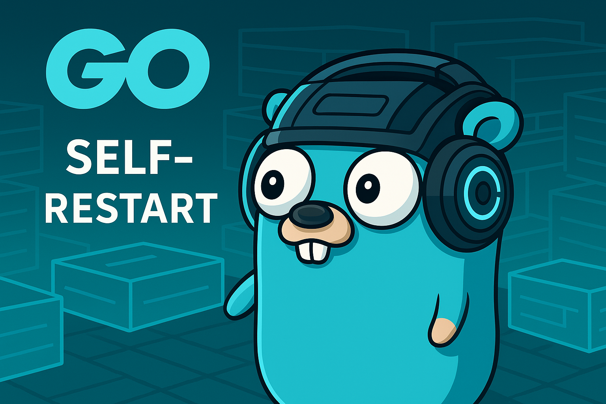

# 

[](https://github.com/rafa-mori/selfrestart/actions/workflows/release.yml)
[](https://golang.org)
[](LICENSE)
[](https://goreportcard.com/report/github.com/rafa-mori/selfrestart)

[🇧🇷 Read this documentation in Portuguese](docs/README.pt-BR.md)

**SelfRestart** is a Go library that allows applications to restart themselves automatically in a safe and elegant way. Unlike other solutions like `go-selfupdate`, this library focuses specifically on **automatic process restart**, offering fine-grained control over the application lifecycle.

## 🎯 Features

- ✅ **Automatic Restart**: Restarts the application preserving arguments and environment
- ✅ **Platform Detection**: Support for Linux, macOS and Windows
- ✅ **Automatic Go Installation**: Installs Go automatically if needed
- ✅ **Process Management**: Complete control over PIDs and signals
- ✅ **Integrated Logging**: Logging system with different levels
- ✅ **Modular**: Clean and well-organized architecture
- ✅ **Thread-Safe**: Safe for use in concurrent applications

## 📦 Installation

```bash
go get github.com/rafa-mori/selfrestart
```

## 🚀 Basic Usage

```go
package main

import (
    "fmt"
    "os"
    "os/signal"
    "syscall"
    
    "github.com/rafa-mori/selfrestart"
)

func main() {
    // Create a SelfRestart instance
    sr := selfrestart.New()
    
    // Check if Go is installed
    if !sr.IsGolangInstalled() {
        fmt.Println("Go is not installed")
        os.Exit(1)
    }
    
    // Setup signal capture
    sigChan := make(chan os.Signal, 1)
    signal.Notify(sigChan, syscall.SIGUSR1)
    
    for {
        select {
        case <-sigChan:
            fmt.Println("Restarting application...")
            if err := sr.Restart(); err != nil {
                fmt.Printf("Error restarting: %v\\n", err)
                os.Exit(1)
            }
            os.Exit(0) // Terminate current process
        }
    }
}
```

## 📚 API Documentation

### Main Structure

```go
type SelfRestart struct {
    // Internal fields (not exposed)
}
```

### Main Methods

#### `New() *SelfRestart`

Creates a new SelfRestart instance.

#### `IsGolangInstalled() bool`

Checks if Go is installed on the system and offers automatic installation if needed.

#### `Restart() error`

Restarts the current process safely.

#### `GetCurrentPID() int`

Returns the current process PID.

#### `KillCurrentProcess() error`

Terminates the current process gracefully.

#### `IsProcessRunning(pid int) (bool, error)`

Checks if a process with the specified PID is running.

#### `InstallGo() (bool, error)`

Installs Go automatically on Unix systems.

#### `GetPlatformInfo() platform.PlatformInfo`

Returns information about the current platform (OS/Architecture).

## 🏗️ Architecture

The project is organized in a modular way:

```
selfrestart/
├── selfrestart.go          # Main public API
├── example/
│   └── main.go            # Usage example
├── internal/
│   ├── install/           # Go installation management
│   ├── platform/          # Platform detection
│   ├── process/           # Process management
│   └── restart/           # Restart logic
└── logger/                # Logging system
```

### Internal Modules

- **install**: Responsible for Go detection and automatic installation
- **platform**: Manages platform and architecture information
- **process**: Controls processes, PIDs and system signals
- **restart**: Implements restart logic using temporary scripts
- **logger**: Integrated logging system

## 🔧 Advanced Example

See the `example/main.go` file for a complete example that demonstrates:

- System signal capture
- Automatic restart via SIGUSR1
- Continuous application monitoring
- Graceful shutdown management

To run the example:

```bash
cd example
go run main.go
```

In another terminal, test the restart:

```bash
# Get the application PID
ps aux | grep main

# Send restart signal
kill -USR1 <PID>
```

## 🎛️ Configuration

### Environment Variables

- `PATH`: Used to detect Go installation

### Command Line Arguments

- `--wait`: Waits for the restart script to be executed completely

## 🧪 Testing

```bash
# Run all tests
go test ./...

# Run tests with coverage
go test -v -race -coverprofile=coverage.out ./...

# View coverage report
go tool cover -html=coverage.out
```

## 🔍 Troubleshooting

### Go not found

```text
ERROR: Go is not installed or not found in PATH
```

**Solution**: The library will offer automatic Go installation.

### Insufficient permissions

```text
ERROR: Error creating restart script: permission denied
```

**Solution**: Run with adequate permissions or check if `/tmp` is writable.

### Process doesn't restart

```text
ERROR: Process did not terminate after interrupt signal
```

**Solution**: Check if there are no blocks in the application that prevent graceful shutdown.

## 🤝 Contributing

1. Fork the project
2. Create a feature branch (`git checkout -b feature/AmazingFeature`)
3. Commit your changes (`git commit -m 'Add some AmazingFeature'`)
4. Push to the branch (`git push origin feature/AmazingFeature`)
5. Open a Pull Request

## 📋 Roadmap

- [ ] Windows Service support
- [ ] systemd integration (Linux)
- [ ] Automatic backup before restart
- [ ] Webhooks for notifications
- [ ] Web interface for monitoring
- [ ] Metrics and monitoring
- [ ] Docker container support

## 📄 License

This project is licensed under the MIT License - see the [LICENSE](LICENSE) file for details.

## 🙏 Acknowledgments

- Inspired by the [go-selfupdate](https://github.com/sanbornm/go-selfupdate) project
- Built with Go community best practices
- Special thanks to contributors

## 📞 Support

- 🐛 **Issues**: [GitHub Issues](https://github.com/rafa-mori/selfrestart/issues)
- 💬 **Discussions**: [GitHub Discussions](https://github.com/rafa-mori/selfrestart/discussions)
- 📧 **Email**: [faelmori@gmail.com]

---

⭐ **If this project was useful to you, consider giving it a star on GitHub!**
