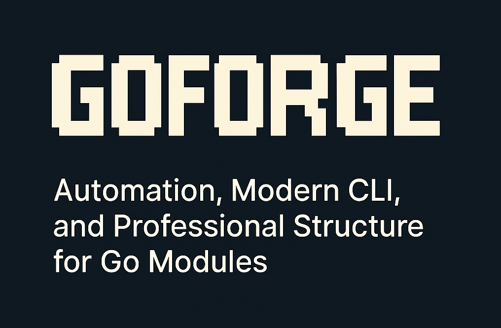

[](https://github.com/rafa-mori/goforge/actions/workflows/release.yml)
[](LICENSE)
[](go.mod)
[](https://github.com/rafa-mori/goforge/releases)

---

[🇧🇷 Read this documentation in Portuguese](docs/README.pt-BR.md)

If you’re tired of manual builds, complicated deploys, confusing versioning, and want a stylish, easy-to-extend, production-ready CLI, **GoForge** is for you!

---

## 🌟 Advanced Examples

### 1. Extending the CLI with a new command

Create a new file at `cmd/cli/hello.go`:

```go
package cli

import (
    "fmt"
    "github.com/spf13/cobra"
)

var HelloCmd = &cobra.Command{
    Use:   "hello",
    Short: "Custom command example",
    Run: func(cmd *cobra.Command, args []string) {
        fmt.Println("Hello, world! Custom command working!")
    },
}
```

In `wrpr.go`, register the command:

```go
// ...existing code...
rootCmd.AddCommand(cli.HelloCmd)
// ...existing code...
```

---

### 2. Advanced logger with extra context

```go
import gl "github.com/rafa-mori/goforge/logger"

func exampleWithContext() {
    gl.Log("warn", "Warning! Something might be wrong.")
    gl.Log("debug", map[string]interface{}{
        "user": "rafael",
        "action": "login",
        "success": true,
    })
}
```

---

### 3. Using as a Go library

```go
import "github.com/rafa-mori/goforge"

func main() {
    var myModule goforge.GoForge = &MyModule{}
    if myModule.Active() {
        _ = myModule.Execute()
    }
}

// Implement the GoForge interface in your module
```

---

## ✨ What is GoForge?

GoForge is a template/base project for any modern Go module. It delivers:

- **Multi-platform build** (Linux, macOS, Windows) with no code changes
- **Automatic UPX compression** for optimized binaries
- **Automatic publishing** to GitHub Releases
- **Unified dependency management**
- **Automatic checksum** to ensure binary integrity
- **Custom, stylish CLI** (cobra), ready to extend
- **Flexible architecture**: use as a library or executable
- **Automatic versioning**: CI/CD fills and embeds the version in the binary
- **Structured logger**: contextual, colored logging with levels and line tracing

All this without changing your module’s code. The workflow is modular, dynamic, and adapts to any environment!

---

## 🏗️ Project Structure

```plain text
./
├── .github/workflows/      # CI/CD workflows (release, checksum)
├── article.go              # GoForge interface for library use
├── cmd/                    # CLI entrypoint and commands
│   ├── cli/                # Utilities and example commands
│   ├── main.go             # CLI application main
│   ├── usage.go            # Custom usage template
│   └── wrpr.go             # Command structure and registration
├── go.mod                  # Go dependencies
├── logger/                 # Global structured logger
│   └── logger.go           # Contextual, colored logger
├── Makefile                # Entrypoint for build, test, lint, etc.
├── support/                # Helper scripts for build/install
├── version/                # Automatic versioning
│   ├── CLI_VERSION         # Filled by CI/CD
│   └── semantic.go         # Semantic versioning utilities
```

---

## 💡 Why use it?

- **No headaches** with builds and deploys
- **Production-ready CLI** that’s easy to customize
- **Powerful logger**: debug, info, warn, error, success, all with context
- **Automatic versioning**: never forget to update your version again
- **Easy to extend**: add commands, use as a library, plug into other projects

---

## 🚀 Getting Started

### 1. Install dependencies

```sh
make install
```

### 2. Build the project

```sh
make build
```

### 3. Run the CLI

```sh
./goforge --help
```

### 4. Add custom commands

Create files in `cmd/cli/` and register them in `wrpr.go`.

---

## 🛠️ Logger usage example

```go
import gl "github.com/rafa-mori/goforge/logger"

gl.Log("info", "Informative message")
gl.Log("error", "Something went wrong!")
```

The logger automatically includes context (line, file, function)!

---

## 🔄 Automatic versioning

The `version/CLI_VERSION` file is filled by CI/CD on every release/tag. The `goforge version` command shows the current and latest version from GitHub.

---

## 🤝 Contribute

Pull requests, issues, and suggestions are very welcome. Let’s evolve together!

---

## 📄 License

MIT. See the LICENSE file.

---

## 👤 Author

Rafael Mori — [@faelmori](https://github.com/rafa-mori)

---

## 🌐 Links

- [GitHub Repository](https://github.com/rafa-mori/goforge)
- [Logger usage example](logger/logger.go)
- [CI/CD Workflows](.github/workflows/)

---

> Made with 💙 for the Go community. Let’s automate everything!
